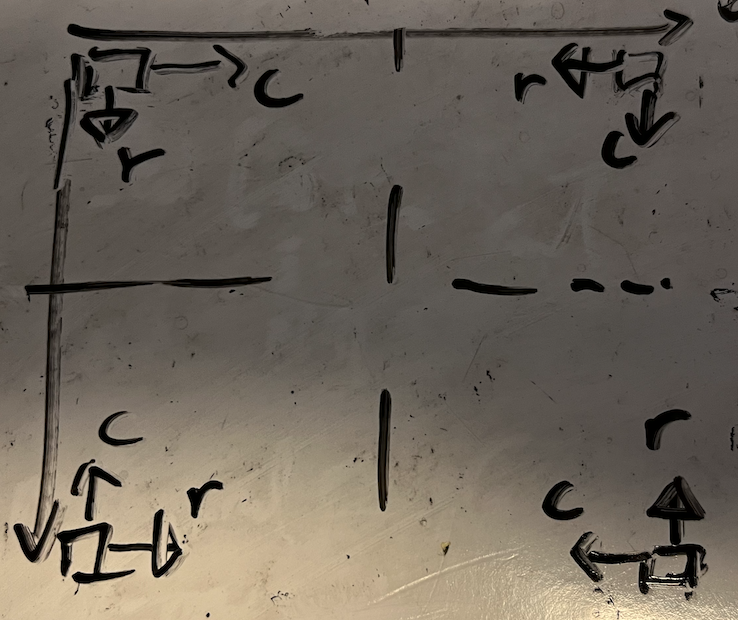

# Basics
### Transpose

```python
def transpose(self, matrix):
    n = len(matrix)
    for i in range(n):
        for j in range(i + 1, n):
            matrix[j][i], matrix[i][j] = matrix[i][j], matrix[j][i]
```

### Reflect
```python
def reflect(self, matrix):
    n = len(matrix)
    for i in range(n):
        for j in range(n // 2):  # dun forget
            matrix[i][j], matrix[i][-j - 1] = matrix[i][-j - 1], matrix[i][j]
```

### Rotate
clockwise 90degree
  
- draw the above graph (when i increase for fixed j, how position would vary) -> one arrow
- draw the above graph (when j increase for fixed i, how position would vary) -> another arrow
`matrix[i][j]` -> `matrix[N-j-1][i]`

# diagonal
n-queens
- Positive diagonal: ↗️ r+c
  - 0...N
  - center: (N//2)*2
- Negative diagonal: ↘️ r-c
  - -(N-1)...(N-1)
  - center: 0
  
