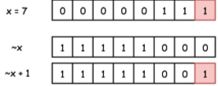

# Sum With Carry
```
sum_without_carry = a ^ b
```

# Carry
note that this doesn't consider the carry being added and carried again
```python
carry = (a&b) << 1
```

# find the difference
find-the-difference by xor

# number of bits and value
number of bits = O(logn), where n is the value

# power of two/four
- and operator on non-power of two/four
- maximum possible value (check whether exist in hex form, 8 charaters 32 bit)
- `(x - 1) == 0` if only one bit is present

# negative
  
`-x = ~x + 1`

# rightmost 1-bit
- `x & (-x)` is a way to keep the rightmost 1-bit and to set all the other bits to 0
