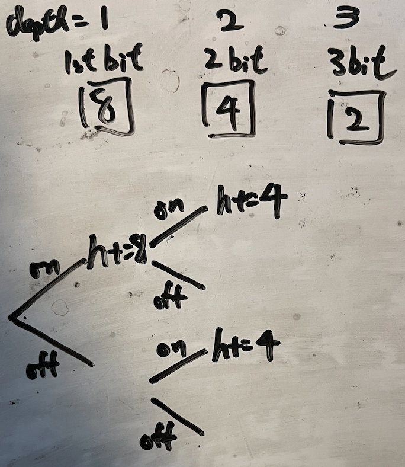

# definition
Backtracking is an algorithm for finding all solutions by exploring all potential candidates. If the solution candidate turns to be not a solution (or at least not the last one), backtracking algorithm discards it by making some changes on the previous step, i.e. backtracks and then try again.

# General approach
example of binary-watch

0. draw the tree, write the skeleton of backtrack function

  
``` python
ans = []  # ans the stores what target has been found

self.remains = n  # status that stores the current choices (given the number of "selected choices" are limited, this is a common technique if array is not used)

self.h = 0 # status that stores the current choices
self.m = 0 # status that stores the current choices
def backtrack(depth):  # depth
  ...

```


1. terminal condition
  - imagine the first depth finish (how much depth to reach)
```python 
if self.remain == 0:
    ans.append("{0}:{1:02d}".format(self.h,self.m))
    return
```

2. rule out the conditions that doesn't find requirement
- depth is over the limitation
- condition is obviously not matched


```python 
if start>=len(lights) or not (0<=self.h<12 and 0<=self.m<60):
    return
```

3. how to backtrack a branch
```python
# this bit is turned on
self.h, self.m = self.h+dh, self.m+dm
self.remain -= 1
backtrack(depth + 1)  # note that depth is proceeded here
self.remain += 1
self.h, self.m = self.h-dh, self.m-dm
```

4. backtrack different branches
- without loop
```python
cur.append(s[first].lower())
backtrack(first+1)
cur.pop()

cur.append(s[first].upper())
backtrack(first+1)
cur.pop()
```

- with for loop (backtrack with Counter)

```python
for i in range(0, count + 1):
  if self.curSum +  i*key > target:  # note: technique to skip other unnecessary branches
      continue
  
  for _ in range(i):
      curCombs.append(key)

  self.curSum +=  i*key
  skipThisDepth = backtrack(start+1)
  self.curSum -=  i*key
  
  for _ in range(i):
      curCombs.pop()
```

- with for loop (backtrack with Counter - conditional branches)
example: permutations-ii
  
```python
from collections import Counter
class Solution:
  def permuteUnique(self, nums: List[int]) -> List[List[int]]:
    sol = []
    candidate = []
    c = Counter(nums)
    keys = c.keys()

    def backtrack(depth):
        if depth == len(nums):
            sol.append(candidate.copy())
            return
        
        for key in keys:
            if c[key] > 0:
                c[key] -= 1
                candidate.append(key)
                backtrack(depth+1)
                c[key] += 1
                candidate.pop()

    backtrack(0)
    return sol
```

# Terminal with side-effect vs terminal with return value
### side-effect
general approach above is using side-effect
keep a `self.ans`, which is accessibly and modifidable by `backtrack()`

### return value
concept: once the target is found, return immediately
example: word-search

1. always surround with `if` and `return True` when using `backtrack`
    ```python
    if backtrack(0,target):
      return True
    ```
2. final line before solution function, use `return False`

# How to avoid revisiting
## for a linear array
reusing depth to filter out some choices are common

## for 2-d array or other data form
- use of `visited`
  - `self.visited.add(target)` just after terminal condition
  - `self.visited.remove(target)` just before end of backtrack
  - make sure no `return` in between
- change the 2-d array element in place
  - make sure after changing element, can be rejected by terminal condition

# Time Complexity
O(N^D) # where B is the maximum number of branches for each depth, and D is the number of depth
