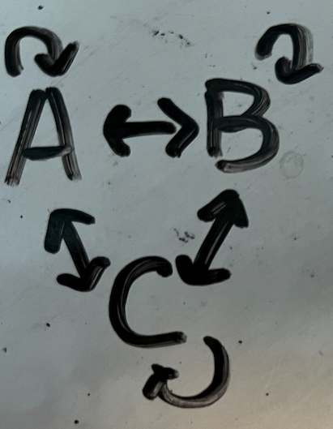
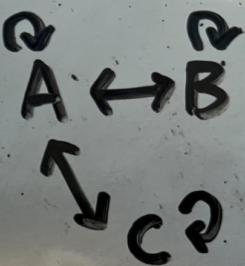

# represent graph using python
other advanced knowledge: see notion [graph theory]


# Build Up Graph Data
  
## Data Representation
```python
graph = {'A': {'B', 'C'},
        'B': {'C', 'D'},
        'C': {'D'},
        'D': {'C'},
        'E': {'F'},
        'F': {'C'}}
# keys of graph are called "edge"
```
## Convert array to all directly connected
  
```python
emails = ['A','B','C']
graph = defaultdict(set)
for email in emails:
    graph[email] |= emails  # -email if not include self-loop
```

## Convert array to all indirectly connected
  
```python
emails = ['A','B','C']
graph = defaultdict(set)
for email in emails:
    graph[a[1]].add(email)
    graph[email].add(a[1])
```


# DFS Transversal of graph (using iteration)
example: accounts-merge

```python
seen = set()  # point 2: avoid visited
ans = []
em_to_name = {}
em_graph = defaultdict(set)

# point 1: try all the nodes
for email in em_graph:
    if email not in seen: # point 2: avoid visited
        st = [email]
        seen.add(email) # point 2: avoid visited (right after addtion to stack)

        # point 4: actions for this cluster here
        component = []
        
        while st:
            edge = st.pop()

            component.append(edge)

            for nei in em_graph[edge]: # point 3: explore next
                if nei not in seen: # point 2: avoid visited
                    seen.add(nei) # point 2: avoid visited (right after addtion to stack)
                    st.append(nei)
                    
        # point 4: actions for this cluster here
        ans.append([em_to_name[email]] + sorted(component))

```

### Example: find-path

```python

def find_path(graph, start, end, path=[]):
        path = path + [start]
        if start == end:
            return path
        if start not in graph:  # normally won't happen
            return None
        for node in graph[start]:  # divide into subproblems
            if node not in path:
                newpath = find_path(graph, node, end, path)
                if newpath: return newpath  # skip unsuccessful paths
        return None

>>> find_path(graph, 'A', 'D')
    ['A', 'B', 'C', 'D']
    >>>
```
