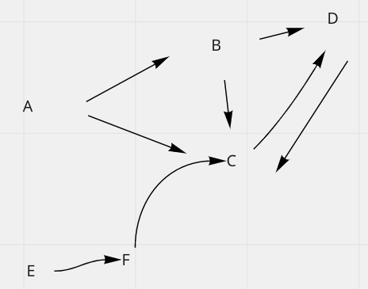

# represent graph using python
other advanced knowledge: see notion [graph theory]


# Build Up Graph Data
  
## Data Representation
```python
graph = {'A': {'B', 'C'},
        'B': {'C', 'D'},
        'C': {'D'},
        'D': {'C'},
        'E': {'F'},
        'F': {'C'}}
# keys of graph are called "edge"
```
## Convert array to all directly connected
  
```python
emails = ['A','B','C']
graph = defaultdict(set)
for email in emails:
    graph[email] |= emails  # -email if not include self-loop
```

## Convert array to all indirectly connected
  
```python
emails = ['A','B','C']
graph = defaultdict(set)
for email in emails:
    graph[a[1]].add(email)
    graph[email].add(a[1])
```


# DFS Transversal of graph (using iteration)
example: accounts-merge

```python
seen = set()  # point 2: avoid visited
ans = []
em_to_name = {}
em_graph = defaultdict(set)

# point 1: try all the nodes
for email in em_graph:
    if email not in seen: # point 2: avoid visited
        st = [email]
        seen.add(email) # point 2: avoid visited (right after addtion to stack)

        # point 4: actions for this cluster here
        component = []
        
        while st:
            edge = st.pop()

            component.append(edge)

            for nei in em_graph[edge]: # point 3: explore next
                if nei not in seen: # point 2: avoid visited
                    seen.add(nei) # point 2: avoid visited (right after addtion to stack)
                    st.append(nei)
                    
        # point 4: actions for this cluster here
        ans.append([em_to_name[email]] + sorted(component))

```

### Example: find-path

```python

def find_path(graph, start, end, path=[]):
        path = path + [start]
        if start == end:
            return path
        if start not in graph:  # normally won't happen
            return None
        for node in graph[start]:  # divide into subproblems
            if node not in path:
                newpath = find_path(graph, node, end, path)
                if newpath: return newpath  # skip unsuccessful paths
        return None

>>> find_path(graph, 'A', 'D')
    ['A', 'B', 'C', 'D']
    >>>
```

# Node Indegree
example: course-schedule-ii

# Handle graph with cycle (recurion)(Topological Sort)
- defininition of Topological Sort
  - find a global order for all nodes in a DAG (Directed Acyclic Graph) with regarding to their dependencies

```python
from collections import defaultdict
class Solution:
    WHITE = 1 # point 1
    GRAY = 2
    BLACK = 3
    
    def findOrder(self, numCourses: int, prerequisites: List[List[int]]) -> List[int]:
        graph = defaultdict(list) # a->b a should start before b
        color = defaultdict(lambda: Solution.WHITE)
        ans = deque()
        self.isPossible = True
        
        for course, prerequisite in prerequisites:
            graph[prerequisite].append(course) # point 2
        
        def dfs(node):
            if not self.isPossible:
                return
            color[node] = Solution.GRAY
            for adj in graph[node]:
                if color[adj] == Solution.GRAY: # point 4
                    self.isPossible = False
                    return
                if color[adj] == Solution.WHITE:
                    dfs(adj)
            color[node] = Solution.BLACK
            ans.append(node) #point 3: stack
            
        
        for i in range(numCourses):
            if color[i] == Solution.WHITE:
                dfs(i)
        
        if not self.isPossible:
            return []
        
        return ans[::-1] #point 3: stack
```

## point 1: use color (Black: Visited, Gray: Visiting, White: Unvisited)

## point 2: A->B to represents A must be done before B starts

## point 3: convert graph into stack
- not path, but represent the prerequisites

## point 4: detect cycle if found gray in adj node


# Handle graph with cycle (iteration)(Topological Sort)
example: course-schedule
```
class GNode(object):
    """  data structure represent a vertex in the graph."""
    def __init__(self):
        self.inDegrees = 0
        self.outNodes = []

class Solution(object):
    def canFinish(self, numCourses, prerequisites):
        """
        :type numCourses: int
        :type prerequisites: List[List[int]]
        :rtype: bool
        """
        from collections import defaultdict, deque
        # key: index of node; value: GNode
        graph = defaultdict(GNode)

        totalDeps = 0
        for relation in prerequisites:
            nextCourse, prevCourse = relation[0], relation[1]
            graph[prevCourse].outNodes.append(nextCourse)
            graph[nextCourse].inDegrees += 1
            totalDeps += 1

        # we start from courses that have no prerequisites.
        # we could use either set, stack or queue to keep track of courses with no dependence.
        nodepCourses = deque()
        for index, node in graph.items():
            if node.inDegrees == 0:
                nodepCourses.append(index)

        removedEdges = 0
        while nodepCourses:
            # pop out course without dependency
            course = nodepCourses.pop()

            # remove its outgoing edges one by one
            for nextCourse in graph[course].outNodes:
                graph[nextCourse].inDegrees -= 1
                removedEdges += 1
                # while removing edges, we might discover new courses with prerequisites removed, i.e. new courses without prerequisites.
                if graph[nextCourse].inDegrees == 0:
                    nodepCourses.append(nextCourse)

        if removedEdges == totalDeps:
            return True
        else:
            # if there are still some edges left, then there exist some cycles
            # Due to the dead-lock (dependencies), we cannot remove the cyclic edges
            return False

```
