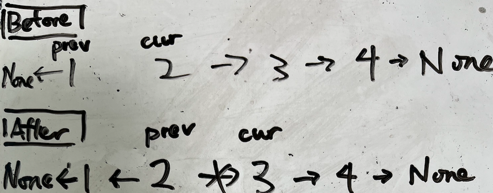
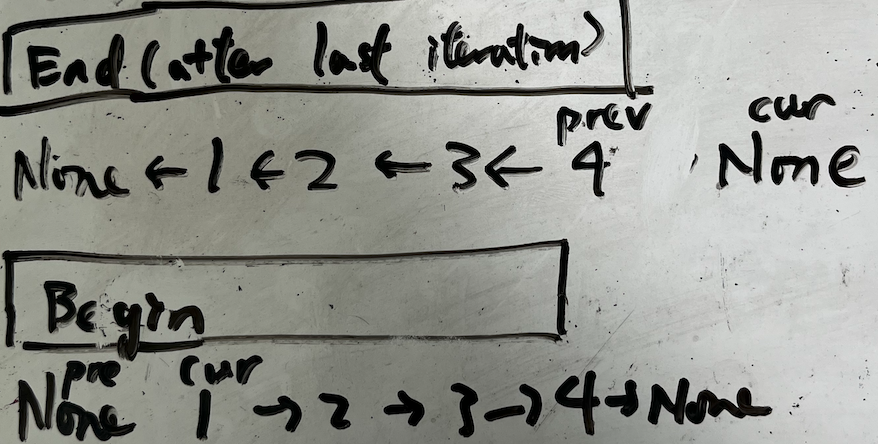

# general approach for fixed solution head
example: remove-duplicates-from-sorted-list
```python
sol = ListNode()  # technique 2
sol.next = head  # technique 1
prev = sol

while prev.next and prev.next.next:  # technique 3
    if prev.next.val == prev.next.next.val:  # technique 3
        prev.next = prev.next.next #operation: remove cur
    else:
        prev = prev.next
        

return sol.next  # technique 1
```

## technque 1
keep a pointer to return solution

## technque 2
dummy head (also named sentinel) to keep a prev, so head can possible be removed

## technque 3
use prev, prev.next, prev.next.next (only keep one variable)
- self translate prev.next to cur, prev.next.next to nex, but no need to keep a variable

# general approach for variable solution head
example: reverse-linked-list
```python
prev = None
cur = head

while cur:
    tmp = cur.next # technqiue 1
    cur.next = prev # technqiue 1

    prev = cur
    cur = tmp
```

## step 1
draw before-after graph for each iteration
  

## step 2
draw check edge case for begin-end
  

- begin
  - don't forget first node (`prev = None` is needed)
- end
  - know what to return at the end
  - think want to do at terminal condition

## Step 3
Code according to graph

### technique 1
when attempt to change arrow, before writing `cur.next = prev` , keep `tmp = cur.next` first

# delete node
```python
targetNode.next.prev = targetNode.prev
targetNode.prev.next = targetNode.next
```

- use dummy head and dummy tail
- doubly linked list is required (single direction is not enough)

# technique of deep copy of node
## point: use dictionary
- solve the problem that same node cannot be identified
- node can be used as a hashkey of dictionary (address)

# merge linked list
merge-two-sorted-lists
merge-k-sorted-lists
