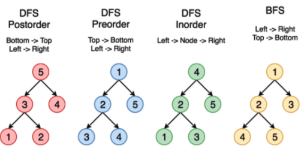

# Basic Knowledge
There is a unique node called root in trees
There will not be any cycle

# object implementation of tree
```python
class Tree:
  def __init__(self):
    self.val = None
    self.left = None
    self.right = None
```

# array implementation of Tree
- children at indices 2i + 1 and 2i + 2
- its parent floor((i − 1) ∕ 2).

# binary search tree
```python
def insert(self, val):
  if self.val:
      if val < self.val:
      		if self.left is None:
          		self.left = Tree(val)
        	else:
          		self.left.insert(val)
      elif val > self.val:
        	if self.right is None:
          		self.right = Tree(val)
        	else:
          		self.right.insert(val)
  else:
    self.val = val
```

# AVL tree = Balanced Tree
look at balanced-binary-tree for details
an ideal type of binary search tree
for every node in the tree, heights of its left and right subtrees, pivotal value (=height factor) differ by at most 1.
- `O((height of tree)^2) = number of nodes`
- `height of tree = O(log2(number of nodes`


## convert list to balanced tree
sort -> choose middle -> preorder transversal

## complexity calculation

2^0 + 2^1 + ... + 2^h = n   (h: height of tree, n: number of nodes)

- time for finding tree height is O(n)

# traversals
  


## Inorder

refer to binary-tree-inorder-traversal
depth first traversals

```python
# A function to do inorder tree traversal
def printInorder(root):
 
    if root:
 
        # First recur on left child
        printInorder(root.left)
 
        # then print the data of node
        print(root.val),
 
        # now recur on right child
        printInorder(root.right)
```

common applications: sort binary search tree into sorted list
```python
def inorder(r: TreeNode):
    return inorder(r.left) + [r.val] + inorder(r.right) if r else []
```

## Preorder
```python
# Example: A function to do preorder tree traversal, print right away
def printPreorder(root):
 
    if root:
 
        # First print the data of node
        print(root.val)
 
        # Then recur on left child
        printPreorder(root.left)
 
        # Finally recur on right child
        printPreorder(root.right)
 
# Example: A function to do preorder tree traversal, return array
 class Solution(object):
    def preorderTraversal(self, root):
        """
        :type root: TreeNode
        :rtype: List[int]
        """
        if not root:
            return []
        return [root.val] + self.preorderTraversal(root.left) + self.preorderTraversal(root.right)
```

# pass info
## from parent to child
- iteration: through (..., ..., ...) as node
- recursion: through parameter
  - example: validate-binary-search-tree

## from child to parent
- recursion: through return value
